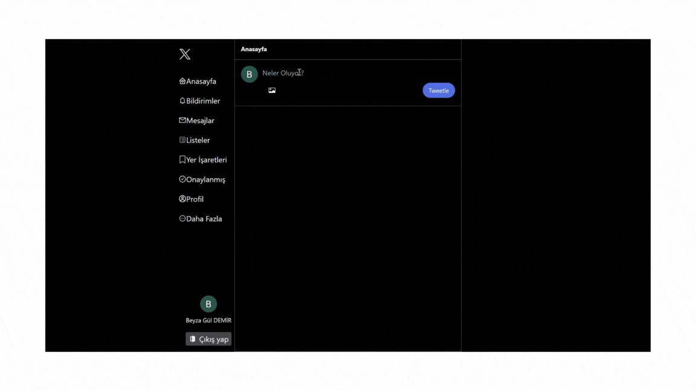

# Kütüphaneler

- react-router-dom
- react-toastify
- react-icons
- moment
- uuid
- firebase
- tailwind

# Authentication (Kimli Doğrulama)

- Bir kullanıcını kimliğini doğrulama sürecidir
- Kullanıcı adı, şifre, parmak izi, yüz tanıma,google hesabı kullanılarak kimlik doğrulanabilir.

# Authorization (Yetkilendirme)

- Bir kullanıcının sisteminin kaynaklarına / işlevlerine /sayfalarına erişim sürecidir.
- Yani kimlik doğrulama başarılı olduktan sonra kullanıcının ne kadar erişime sahip olduğunu belirleme sürecidir.

# Ozellikler

- Kullanıcı Girişi ve Çıkışı: Google ile oturum açma özelliği, oturum açmış kullanıcı bilgilerini gösterir ve oturumu kapatma işlevi sağlar.

- Tweet Gönderme: Kullanıcılar, metin ve resim içeren tweet'ler oluşturabilir ve paylaşabilirler.

- Gerçek Zamanlı Veri Güncellemeleri: Firebase  kullanılarak, tweet'ler gerçek zamanlı olarak güncellenir ve kullanıcılar anlık olarak en son tweet'leri görebilir.

- Tweet Düzenleme ve Silme: Kullanıcılar kendi tweet'lerini düzenleyebilir veya silebilirler. Ayrıca tweet'ler üzerinde düzenleme yapılabilir.

- Medya Yükleme: Firebase  kullanılarak tweet'lere resim yükleme desteği sunar.

- Etkileşim Özellikleri: Tweet'ler üzerinde beğenme, retweet yapma ve yorum yapma işlevselliği mevcuttur.

- Kullanıcı Profili: Kullanıcı bilgileri ve profil fotoğrafı gösterimi ile kişiselleştirilmiş bir deneyim sağlar.

- Responsive Tasarım: Mobil cihazlar ve masaüstü bilgisayarlar için uyumlu ve kullanıcı dostu arayüz.

# GIF

